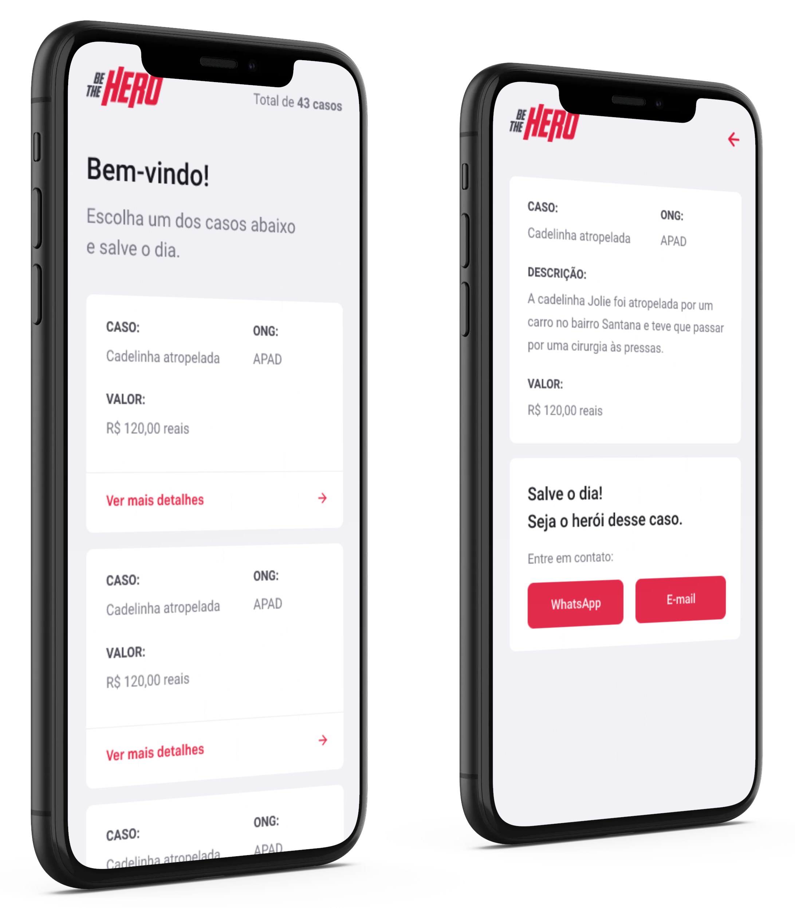

<h1 align="center">
  <!-- <a href="#"> -->
    
  <!-- </a> -->
</h1>

<h5 align="center">
    🦸‍♀️🦸‍♂️ Register your NGO on our platform, to find a hero to help your cause.
</h5>

<p align="center">
  <!-- <a href="#art-app-ui">🎨 App UI</a>&nbsp;&nbsp;&nbsp;&nbsp;|&nbsp;&nbsp;&nbsp; -->
  <a href="#flying_saucer-technologies">🛸 Technologies</a>&nbsp;&nbsp;&nbsp;&nbsp;|&nbsp;&nbsp;&nbsp;
  <a href="#warning-prerequisites">⚠️ Prerequisites</a>&nbsp;&nbsp;&nbsp;&nbsp;|&nbsp;&nbsp;
  <a href="#grey_question-how-to-use">❔ How To Use</a>&nbsp;&nbsp;&nbsp;&nbsp;|&nbsp;&nbsp;&nbsp;
  <a href="#bookmark-badges">🔖 Badges</a>&nbsp;&nbsp;&nbsp;&nbsp;|&nbsp;&nbsp;&nbsp;
  <a href="#closed_lock_with_key-license">🔐 License</a>
</p>

<!-- <br> -->

<!-- ## :art: App UI --> 

<br>

<p align="center">
  
</p>

## :flying_saucer: Technologies

This project was developed at the [RocketSeat OmniStack 11](https://rocketseat.com.br) with the following technologies:

-  [Axios](https://github.com/axios/axios)
-  [Expo](https://expo.io/)
-  [Expo Constants](https://github.com/expo/expo/tree/master/packages/expo-constants)
-  [Expo Mail Composer](https://github.com/expo/expo/tree/master/packages/expo-mail-composer)
-  [Intl.js](https://github.com/andyearnshaw/Intl.js)
-  [Commitlint](https://github.com/conventional-changelog/commitlint)
-  [Commitizen](https://github.com/commitizen/cz-cli)
-  [Husky](https://github.com/typicode/husky)
-  [Jest](https://jestjs.io/)
-  [ReactJS](https://reactjs.org/)
-  [React Native](https://reactnative.dev/)
-  [React Native Gesture Handler](https://github.com/software-mansion/react-native-gesture-handler)
-  [React Native Reanimated](https://github.com/software-mansion/react-native-reanimated)
-  [React Native Safe Area Context](https://github.com/th3rdwave/react-native-safe-area-context)
-  [React Native Screens](https://github.com/software-mansion/react-native-screens)
-  [Semantic-release](https://semantic-release.gitbook.io/semantic-release/)
-  [VS Code][vc]

## :warning: Prerequisites

In order to use and test the mobile app on a simulator or on your physical smartphone, you should've already setup the development environment for React Native applications. You can follow the following article (PT-BR) to setup your environment: [React Native Environment (Android/iOS)](https://docs.rocketseat.dev/ambiente-react-native/introducao).

And also, firstly i recommend that you access and run the backend repository for a complete experience.

<a href="https://github.com/caiohenrique-developer/be-the-hero-api">
  
</a>

## :grey_question: How To Use

To clone and run this application locally, you'll need [Git](https://git-scm.com), [Node.js v10.16][nodejs] or higher + [Yarn v1.13][yarn] or higher installed on your computer.

<details open>
  <summary>Hit me to toggle collapse: 🕹️🤏</summary>

  _From your `command line` follow these steps..._

  ```bash
  # Clone the project
  $ git clone https://github.com/caiohenrique-developer/be-the-hero-mob 'BeTheHero-Mob' && cd 'BeTheHero-Mob'

  # Install dependencies
  $ yarn
  # or
  $ npm i

  # ** Simulator **

  # If you want to run the project on a simulador like Android Studio or Genymotion, start the react-native server as it is
  $ yarn start
  # or
  $ npm start

  # On another terminal, install the app on your simulator
  # Start the project using the command below for Android devices
  $ yarn android
  # or
  $ npm android

  # or

  # Start the project using the command below for iOS devices
  $ yarn ios --simulator="iPhone XS Max"
  # or
  $ npm ios --simulator="iPhone XS Max"

  # ** Physical Smartphone **

  # If you want to run the project on your physical smartphone, change the baseURL on src/services/api.js to your machine's ethernet adapter IP. Use the ethernet adapter IP if you're on a cable connection or the WiFi adapter IP if you're on a wireless conecction.
  # After changing the baseURL, start the react-native server
  $ yarn start
  # or
  $ npm start

  # On another terminal, install the app on your physical smartphone
  # Start the project using the command below for Android devices
  $ yarn android
  # or
  $ npm android

  # Start the project using the command below for iOS devices
  $ yarn ios
  # or
  $ npm ios

  # Very well, now you can enjoy this project ;)
  ```

  + <details>
      <summary>See also: 🕹️🤏</summary>

      #### API

      <a href="https://github.com/caiohenrique-developer/be-the-hero-api">
        
      </a>

      #### WEB

      <a href="https://github.com/caiohenrique-developer/be-the-hero-web">
        
      </a>
    </details>
</details>

<p align="center">
  
</p>

## :bookmark: Badges

<p align="center">
  

  

  <a href="https://www.codacy.com/app/caiohenrique-developer/be-the-hero-mob?utm_source=github.com&amp;utm_medium=referral&amp;utm_content=caiohenrique-developer/be-the-hero-mob&amp;utm_campaign=Badge_Grade">
    
  </a>

  <a href="https://github.com/caiohenrique-developer/be-the-hero-mob/commits/master">
    
  </a>

  <a href="https://github.com/caiohenrique-developer/be-the-hero-mob/releases">
    
  </a>

  <br>

  <a href="https://github.com/caiohenrique-developer/be-the-hero-mob/tags">
    
  </a>

  <a href="https://github.com/caiohenrique-developer/be-the-hero-mob/issues">
    
  </a>

  

  

  <a href="https://github.com/semantic-release/semantic-release">
    
  </a>
</p>

## :closed_lock_with_key: License

This project is under the MIT license. See the [LICENSE](https://github.com/caiohenrique-developer/be-the-hero-mob/blob/master/LICENSE) for more information.

---

<blockquote align="center">Done with ♥ by myself ☝️ <a href="https://www.linkedin.com/in/caio-henrique-024627171/">Get in touch!</a></blockquote>

[nodejs]: https://nodejs.org/
[yarn]: https://yarnpkg.com/
[vc]: https://code.visualstudio.com/
[vceditconfig]: https://marketplace.visualstudio.com/items?itemName=EditorConfig.EditorConfig
[vceslint]: https://marketplace.visualstudio.com/items?itemName=dbaeumer.vscode-eslint
[vcprettier]: https://prettier.io/
